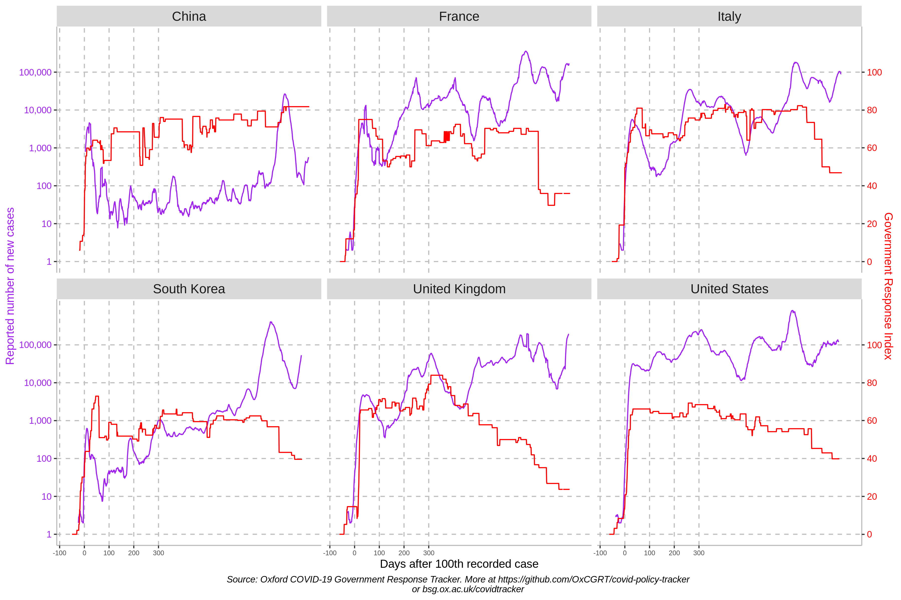
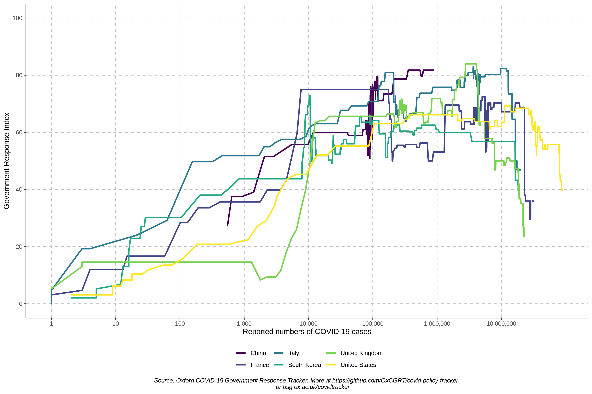
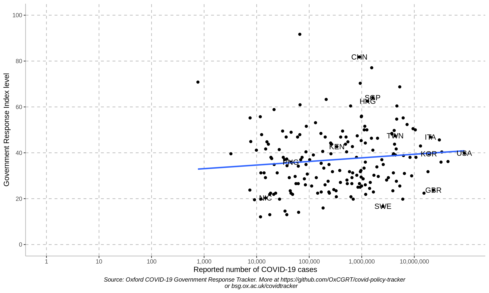
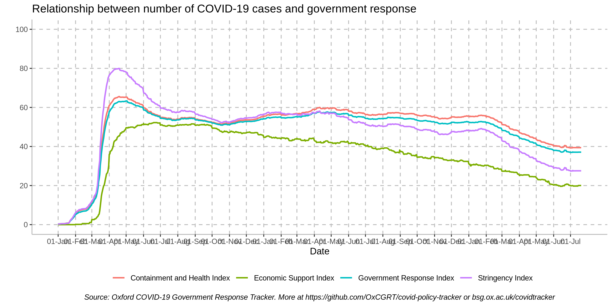
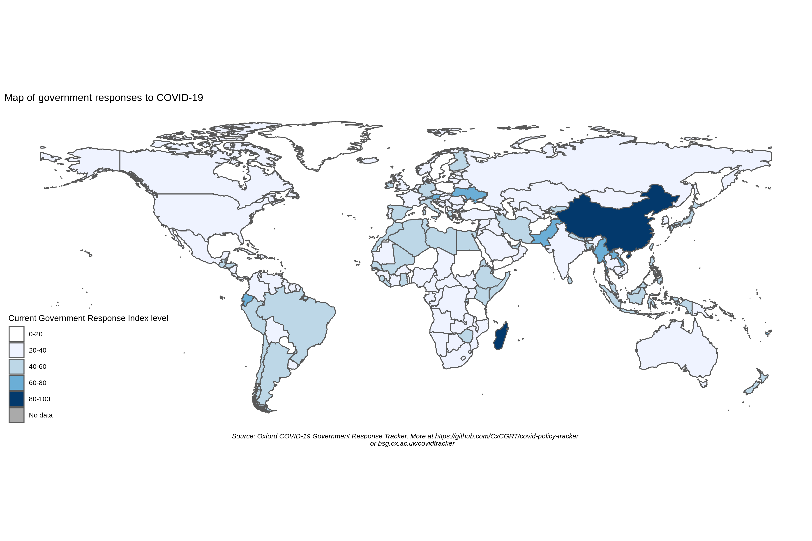
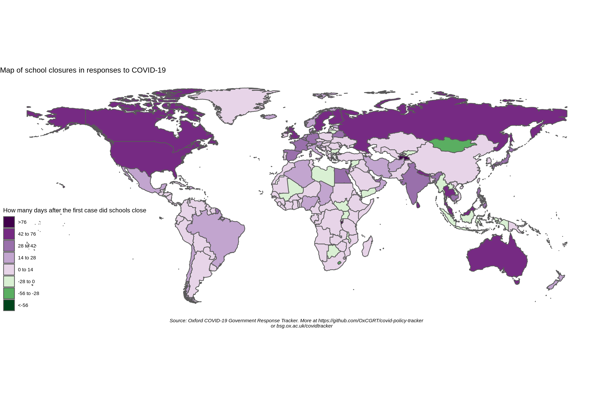

| **Major update, July 2022** |
| --- |
| On 27 July 2022 the OxCGRT implemented data changes which incorporate different policies applying to vaccinated and non-vaccinated people. This results in breaking changes to the csv files published on Github, and the addition of new csv files.   All of our [documentation](/documentation) has been updated to reflect these changes, and we have also published a [PDF summary of the changes](https://www.bsg.ox.ac.uk/sites/default/files/OxCGRT%20–%C2%A0What%27s%20changed%20summary%2022%20Jul%202022.pdf) separately.   **For those looking to make a quick update to a script using our main csv files (eg. OxCGRT_latest.csv)**, we recommend:  <ul><li>Edit indicators C1-C7, H6 and H8 to follow the logic: `CX` to `CXM` (e.g., replace `C1_School closing` with `C1M_School closing`). These indicators report values for the majority of the population vaccinated or non-vaccinated when there is differentiation.</li><li>Edit indicator `C8_International travel controls` to be `C8EV_International travel controls`. This indicator reports the vaccinated value when there is differentiation.</li><li>Edit indices to add `_average` after the index name (e.g., `stringencyindex` to `stringencyindex_average`).</li><li>Change the CSV file name from `OxCGRT_latest.csv` to `OxCGRT_nat_latest.csv` (if you are looking for subnational data, this has been split into separate files).</li></ul> Note that each of these changes reflect a new and slightly different meaning and interpretation. This is explained in detail in our [codebook](documentation/codebook.md). In general, these indicators will report a lower policy level if there is a lenient policy that applies to a large portion of vaccinated people.   For those who wish to continue using the previous data structure and variables - we have established a [legacy repo](https://github.com/OxCGRT/covid-policy-tracker-legacy) where we will continue to publish updated data in our old format. If you have been using our OxCGRT_latest.csv file, you can access the legacy version of the file at this URL: `https://raw.githubusercontent.com/OxCGRT/covid-policy-tracker-legacy/main/legacy_data_202207/OxCGRT_latest.csv`.   **For those wishing to explore our new expanded dataset, the key changes are:**  <ul><li>Data for subnational jurisdictions (USA, Canada, United Kingdom, Brazil, China, India, and Australia) are now published in separate data files.</li><li>The following ten indicators are split into separate variables for non-vaccinated (NV) people and vaccinated (V) people where policies differ between these groups: C1, C2, C3, C4, C5, C6, C7, C8, H6 and H8.</li><li>If there is no differentiated policy in place, we report a single variable for Everyone (E). We also report the policy that applies to a Majority (M) of people at any point in time, based on vaccination rate.</li><li>We publish versions of our indices weighted by vaccination rate.</li></ul>   We have a mailing list we use to provide technical users with detailed release notes and advance warning of changes to database structure. You can register for these email updates here: http://eepurl.com/hiMsdL |

# Oxford Covid-19 Government Response Tracker (OxCGRT)

The Oxford Covid-19 Government Response Tracker (OxCGRT) collects information on which governments have taken which measures, and when. This can help decision-makers and citizens understand governmental responses in a consistent way, aiding efforts to fight the pandemic. The OxCGRT systematically collects information on several different common policy responses governments have taken, records these policies on a scale to reflect the extent of government action, and aggregates these scores into a suite of policy indices. We also collect differentiated policies data where different policies apply to people who are vaccinated and non-vaccinated.

This is a project from the [Blavatnik School of Government](www.bsg.ox.ac.uk). More information on the OxCGRT is available on the school's website: https://www.bsg.ox.ac.uk/covidtracker. This README contains information about using the database.

---
#### Citing our data

Our data is made available free to use for any purpose under a Creative Commons CC BY 4.0 license (see: [our license](https://github.com/OxCGRT/covid-policy-tracker/blob/master/LICENSE.txt), and a [summary of CC BY 4.0](https://creativecommons.org/licenses/by/4.0/) at Creative Commons), this means you must give appropriate credit and link back to our original work. Here are three suggested ways to cite our work:

- _Recommended reference for academic publications_: Thomas Hale, Noam Angrist, Rafael Goldszmidt, Beatriz Kira, Anna Petherick, Toby Phillips, Samuel Webster, Emily Cameron-Blake, Laura Hallas, Saptarshi Majumdar, and Helen Tatlow. (2021). “A global panel database of pandemic policies (Oxford COVID-19 Government Response Tracker).” Nature Human Behaviour. https://doi.org/10.1038/s41562-021-01079-8
- _Short credit for media use (CC BY 4.0 License)_: Oxford COVID-19 Government Response Tracker, Blavatnik School of Government, University of Oxford.
- _Full credit for media use (CC BY 4.0 License)_: Thomas Hale, Anna Petherick, Jessica Anania, Bernardo Andretti de Mello, Noam Angrist, Roy Barnes, Thomas Boby, Emily Cameron-Blake, Alice Cavalieri, Martina Di Folco, Benjamin Edwards, Lucy Ellen, Jodie Elms, Rodrigo Furst, Liz Gomes Ribeiro, Kaitlyn Green, Rafael Goldszmidt, Laura Hallas, Beatriz Kira, Maria Luciano, Saptarshi Majumdar, Thayslene Marques Oliveira, Radhika Nagesh, Toby Phillips, Annalena Pott, Julia Sampaio, Helen Tatlow, Adam Wade, Samuel Webster, Andrew Wood, Hao Zha, Yuxi Zhang. Oxford COVID-19 Government Response Tracker, Blavatnik School of Government, University of Oxford. 

---

## The database

OxCGRT collects publicly available information on 21 indicators of government response. This information is collected by a team of over 200 volunteers from the Oxford community and is updated continuously.

Alongside our own data, we also include statistics on the number of reported Covid-19 cases and deaths in each country. These are taken from the [JHU CSSE data repository](https://github.com/CSSEGISandData/COVID-19) for all countries and the US States. We also include vaccination data in each jurisdiction – using national-level data from [Our World in Data](https://github.com/owid/covid-19-data/blob/master/public/data/vaccinations/vaccinations.csv) (the percentage of people fully vaccinated) and a range of other sources for subnational vaccination data in [Australia](https://vaccinedata.covid19nearme.com.au/data/air_residence.json),  [Brazil](https://raw.githubusercontent.com/wcota/covid19br/master/cases-brazil-states.csv), [Great Britain](https://github.com/owid/covid-19-data/blob/master/public/data/vaccinations/vaccinations.csv), and the [United States](https://github.com/owid/covid-19-data/blob/master/public/data/vaccinations/vaccinations.csv).
 

### Individual policy measures

Full descriptions of the policy indicators and their meaning can be found in our [codebook](documentation/codebook.md). For more detailed guidance about the codebook and how we interpret the indicators, see the [coding interpretation guide](documentation/interpretation_guide.md). This ensures consistency, and standardizes coding across the database.

Eight of the policy indicators (C1-C8) record information on [_containment and closure_ policies](documentation/codebook.md#containment-and-closure-policies), such as school closures and restrictions in movement. Four of the indicators (E1-E4) record [_economic_ policies](documentation/codebook.md#economic-policies) such as income support to citizens or provision of foreign aid. Eight indicators (H1-H8) record [_health system_ policies](documentation/codebook.md#health-system-policies) such as the Covid-19 testing regime or emergency investments into healthcare. Three indicators (V1-V3) record [_vaccination_ policies](documentation/codebook.md#vaccination-policies); a country/region/territory’s priority list, eligible groups, and the individual cost of vaccination.

We also record [_differentiated policies_](documentation/codebook.md#differentiation-of-policies-by-vaccine-status) for vaccinated people and non-vaccinated people for 10 indicators: C1-C8, H6, and H8. We define differentiated policies to mean policies where vaccinated people can access greater freedoms due to their vaccination status, and are subject to less stringent restrictions. 

Finally, we have a [miscellaneous indicator (M1)](documentation/codebook.md#miscellaneous-policies) for notes that do not fit elsewhere.

### Policy indices

To help make sense of the data, we have produced four indices that aggregate the data into a single number. Each of these indices report a number between 0 to 100 that reflects the level of the governments response along certain dimensions. This is a measure of how many of the relevant indicators a government has acted upon, and to what degree. The index cannot say whether a government's policy has been implemented effectively.

- overall government response index (all indicators)
- containment and health index (all C and H indicators)
- stringency index (all C indicators, plus H1 which records public information campaigns)
- economic support index (all E indicators)

(_Note: these only include indicators recorded on ordinal scales, so they all exclude E3, E4, H4, H5, and M1._)

We also produce different iterations of each index giving different weightings to differentiated policies that apply differently to people based on vaccination status. The [documentation folder](documentation/) contains an [index methodology](documentation/index_methodology.md) explaining how the different indices are calculated and how they are reported for days with incomplete data. This also describes the methodology for the [legacy stringency index](documentation/index_methodology.md#legacy-stringency-index) which is based on the [old](#legacy-database-structure-from-before-25-April-2020) database structure in place prior to 25 April 2020.

### Subnational data

In addition to country-level data, our primary dataset additionally includes some subnational data. So far we have incorporated data for US states, Brazilian states, UK devolved nations, Canadian provinces and territories, Chinese provinces, Australian states and territories, and Indian states into the primary dataset on this covid-policy-tracker repository. These subnational entities are included in their own designated folders in the [data](data) folder.

We are still in the process of collecting differentiated data for Brazil and India, and so these files are published using our old legacy data format. (More information on our legacy data can be found in our [OxCGRT/covid-policy-tracker-legacy](https://github.com/OxCGRT/covid-policy-tracker-legacy) repo.)

Subnational data can be interpreted using the main [codebook](documentation/codebook.md), with additional guidance on subnational-specific interpretation available in the [documentation folder](documentation/subnational_interpretation.md). The subnational data included in our primary dataset aims to describe the overall policy environment that applies to residents of the state or equivalent jurisdiction, and so includes policies set by the national government where those values are more stringent than state-level action. 

### Our documentation and working papers have more information

The most up-to-date description of database components is here in the [documentation folder](documentation/) of this GitHub repo, which contains a detailed [codebook](documentation/codebook.md), [index methodology](documentation/index_methodology.md), a [coding interpretation guide](documentation/interpretation_guide.md), and notes on [subnational interpretation](documentation/subnational_interpretation.md).

We have also published a national [working paper](https://www.bsg.ox.ac.uk/research/publications/variation-government-responses-covid-19) with our national methodology, data collection protocols, and description of the individual indicators. 

### Legacy database structures

Prior to 25 April 2020 the OxCGRT had a structure of 13 indicators (labelled S1-S13). And prior to July 2022, our data structure was simpler as we were not publishing policies that differentiated between people who are vaccinated vs. non-vaccinated. You can find data using our legacy database structures in our dedicated [legacy repo](https://github.com/OxCGRT/covid-policy-tracker-legacy).

## Using OxCGRT data

The OxCGRT is updated continuously in real time. There are numerous ways you can access the raw data.

### Getting data from this GitHub repository
 <-- status of connection to OxCGRT database

Our data is published as CSV files in the [/data](/data) folder of this repository, **and this is our recommended option to access our data**. The data is provided in several formats – including a simple [timeseries](/data/timeseries) format – and subnational data is contained in specific folders.

Below is a summary of what is contained in each csv file, what each abbreviation represents, and a list of the contents of each folder. The [codebook](/documentation/codebook.md) and [index methodology](documentation/index_methodology.md) documentation contains more information about what each indicator and index represents.

We collect data across five different types of policy indicators (C, E, H, M, V). The data that relate to vaccine policy (eg. avaialbility of vaccines to different populations) is spread across over 100 raw variables (as [described in our codebook](/documentation/codebook.md#vaccination-policies)), and so some of our files contain 10 simple summary indicators of this information.

| File designation | C | E | H | M | Vaccine summary | Vaccine raw | notes |
| --- | --- | --- | --- | --- | --- | --- | --- |
| `latest` | yes | yes | yes | yes | yes | | |
| `differentiated_withnotes` | yes | yes | yes | yes | yes | | yes |
| `timeseries` | yes | yes | yes | yes | | |
| `vaccines_full` | | | | | yes | yes | yes |

<!--
| `latest_all_changes` | yes | yes | yes | yes | | | |
| `latest_combined*` | yes | yes | yes | yes | | | |
*Note: In the `latest_combined` files, please note that as described in the codebook, many of our indicators are recorded across two variables: one that records the strictness of the policy, and one that records its scope. 
- This is reported as a combination of the policy level (a number) and the scope flag (a letter: T for targeted policies or G for general policie; or F/A flags for indicator E1). For instance, for C3_Cancel public events we would have 0, 1T (recommend cancelling in some areas), 1G (recommend cancelling everywhere), 2T (require cancelling in some areas), 2G (require cancelling everywhere).
- We also include a numerical combination, using the same methodology to calculate compenents for our indices: a targeted policy is considered a half-step lower than a general jurisdiction-wide policy. For instance, for C3_Cancel public events we would have 0, 0.5 (recommend cancelling in some areas), 1(recommend cancelling everywhere), 1.5 (require cancelling in some areas), 2 (require cancelling everywhere).
-->

For some of our contained and health indicators (C and H), we differentiate the policies depending on whether they apply to everyone (`E`), non-vaccinated people (`NV`), or vaccinated people (`V`). This information, combined with the vaccination rate, allows us to determine what policy applies to the majority (`M`) of people. We publish different combinations of this information in different files. (Our [codebook](/documentation/codebook.md#differentiation-of-policies-by-vaccine-status) has more information about these differentiated policies.)

| File designation | E | NV | V | M* |
| --- | --- | --- | --- | --- |
| `latest` | | | | yes |
| `differentiated_withnotes` | yes | yes | yes | yes |
| `timeseries` | | | | yes |

Prior to July 2022 we published data in a different structure wihtout this differentiated information. We continue to publish data under that old structure in our [legacy repo](https://github.com/OxCGRT/covid-policy-tracker-legacy).

### Getting data through our API
You can also get some OxCGRT national-level data through an API, although this is out-of-date and does not reflect our new (post July 2022) data structure with policies that differentiate between vaccinated and non-vaccinated people. We do not recommend new users use this API. Documentation for this is [published here](https://covidtracker.bsg.ox.ac.uk/about-api).

### Data quality

It is important to understand the limitations of this dataset, most of which stem from the "live" nature of data collection. Our first goal is to publish a real-time dataset; but this carries risks. For instance, you may get a version of the database that was exported just as our team was half-way through entering new data, or that was exported in the window between an error being made and being fixed.

For details on how these issues around patchy or missing data affect our index calculations, please see our [documentation on calculating indices](documentation/index_methodology.md).

- **Be skeptical of reductions in index values**. Incomplete or missing data will sometimes cause a dip in the calculated  index (we conservatively treat some missing values as 0). For most countries, a reduction in index level that is recent, relatively small (less than 10 points), or only lasts a couple of days, is more likely the result of missing data rather than a legitimate reduction in the underlying policy.
- **Not all countries are equally up to date**. We try to ensure that all countries and relevant subnational units are updated at least once every two weeks, and many countries are updated more frequently. But there will inevitably be "patchiness" within the last month.
- **For each country/territory, some indicators will be missing in some days**. As our data collectors find information, they will update a country/territory in real time. This means a country/territory may only have up-to-date information for some indicators, but not all.
- **Some indicators (and therefore, index values) will be changed retroactively.** We aim to have a second pair of eyes review every data point in the OxCGRT. Inevitably, some things may be tweaked in this review process, leading to changes to past dates. We recommend you frequently download fresh data from OxCGRT, rather than relying on an old export.
- **Null values are not the same as 0**. The gaps described above – where countries are not up to date, or where some indicators are missing – will be represented as null values. These should not be interpreted as a 0, although for the purposes of calculating our indices, we conservatively treat them as such.
- **Fiscal and monetary indicators are not evenly covered**. We do not have comprehensive and high quality coverage of our indicators E3, E4, H4, and H5. You should check the data carefully before relying on these indicators, and do not assume they are perfectly comprehensive.

## Legacy data structures

Over the years, as we contiunue to build our database and add features we have had to retire two now-outdated data structures. This occured in April 2020 when we moved from 13 "S" indicators to our current range of C/E/H indicators (the later addition of several H indicators, and the new V indicators, were added on to the existing C/E/H data structure). In July 2022, we retired that post-April 2020 data structure with the advent of our "differentiated" coding, which introduced up to four versions of 10 of the indicators, depending on how the policies applied to people based on vaccination status.

If you are interested in our legacy data structures, they are published in a separate [OxCGRT/covid-policy-tracker-legacy](https://github.com/OxCGRT/covid-policy-tracker-legacy) repository.

## Sample analysis

Here are several examples of the type of analysis enabled by OxCGRT:

### Analysis of specific countries

An individual chart of each country/territory is in the [/images/country charts](images/country_charts/) folder.

### Global comparisons

